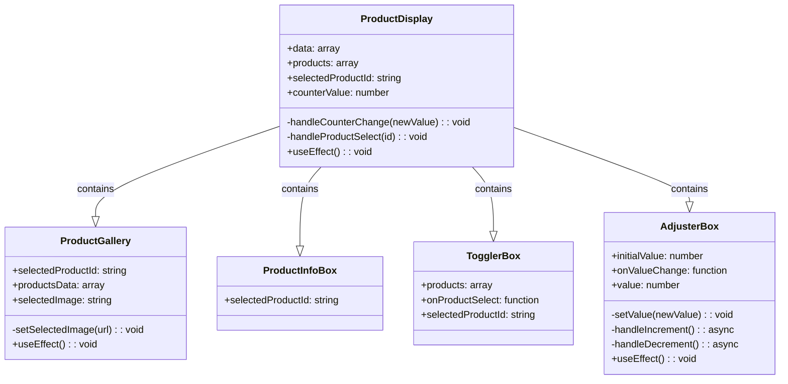
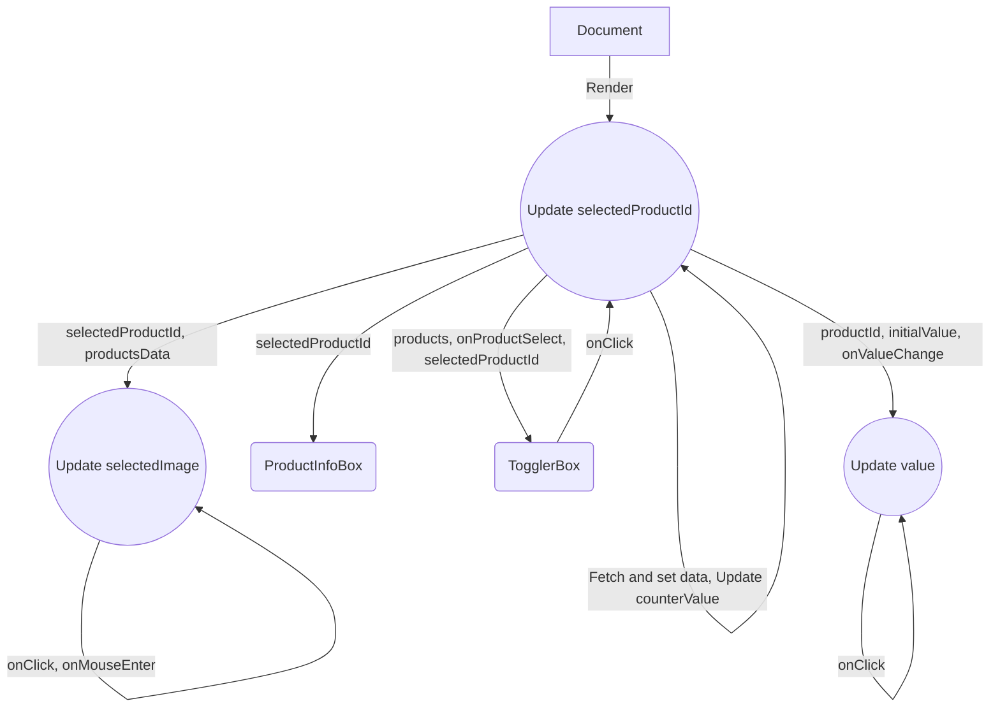

```mermaid
classDiagram
    class ProductDisplay{
      +data: array
      +products: array
      +selectedProductId: string
      +counterValue: number
      -handleCounterChange(newValue): void
      -handleProductSelect(id): void
      +useEffect(): void
    }

    class ProductGallery{
      +selectedProductId: string
      +productsData: array
      +selectedImage: string
      -setSelectedImage(url): void
      +useEffect(): void
    }

    class ProductInfoBox{
      +selectedProductId: string
    }

    class TogglerBox{
      +products: array
      +onProductSelect: function
      +selectedProductId: string
    }

    class AdjusterBox{
      +initialValue: number
      +onValueChange: function
      +value: number
      -setValue(newValue): void
      -handleIncrement(): async
      -handleDecrement(): async
      +useEffect(): void
    }

    ProductDisplay --|> ProductGallery : contains
    ProductDisplay --|> ProductInfoBox : contains
    ProductDisplay --|> TogglerBox : contains
    ProductDisplay --|> AdjusterBox : contains

```

```mermaid
graph TD
    A[ProductDisplay] -->|selectedProductId, productsData| B(ProductGallery)
    A -->|selectedProductId| C(ProductInfoBox)
    A -->|products, onProductSelect, selectedProductId| D(TogglerBox)
    A -->|productId, initialValue, onValueChange| E(AdjusterBox)
    B -->|onClick, onMouseEnter| B((Update selectedImage))
    D -->|onClick| A((Update selectedProductId))
    E -->|onClick| E((Update value))
    F[Document] -->|Render| A
    A -->|Fetch and set data, Update counterValue| A
```
